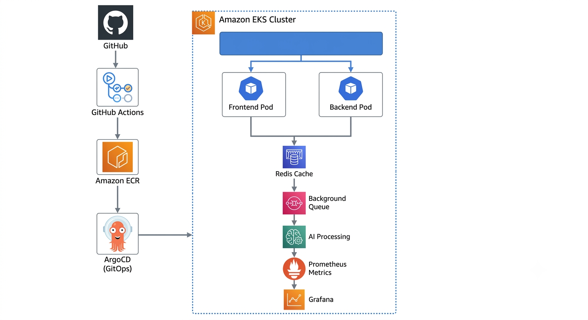
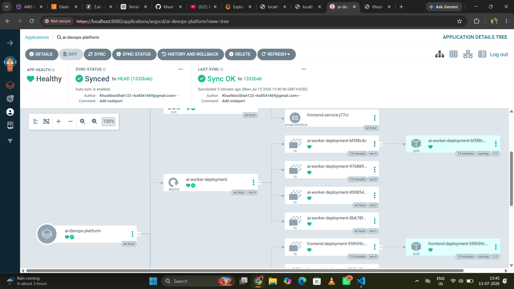
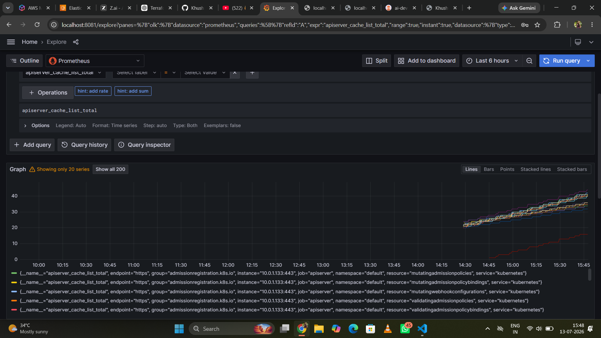

<div align="center">

# 🚀 AI-Powered DevOps Analytics Platform

### Kubernetes • AWS EKS • Terraform • GitOps • ArgoCD • Redis • Prometheus • Grafana


A cloud-native DevOps project demonstrating Infrastructure as Code, Kubernetes deployment, GitOps, monitoring, caching, and asynchronous background processing on **AWS EKS**.

</div>

---

# 📖 Overview

This project simulates an **AI-powered DevOps analytics platform** where users submit a GitHub repository URL through a web interface.

The backend analyzes the repository (currently simulated), calculates DevOps readiness scores, caches results for faster responses, and processes AI fix requests asynchronously.

The project focuses on demonstrating **modern DevOps architecture**, cloud deployment, and production-oriented engineering practices.

---

# 🏗️ High-Level Architecture

<p align="center">
  
</p>

<p align="center">
<b>Figure 1:</b> End-to-end architecture of the AI-Powered DevOps Analytics Platform.
</p>

---

# ⚙️ Technology Stack

| Layer | Technology |
|--------|------------|
| Cloud | AWS |
| Kubernetes | Amazon EKS |
| Infrastructure | Terraform |
| Containerization | Docker |
| Registry | Amazon ECR |
| GitOps | ArgoCD |
| Backend | Flask |
| Frontend | Nginx |
| Cache | Redis |
| Monitoring | Prometheus + Grafana |
| CI | GitHub Actions |

---

# 📂 Repository Structure

```text
ai-devops-platform/

├── app-code/
│   ├── backend/
│   └── frontend/
│
├── terraform/
│   ├── VPC
│   ├── EKS
│   ├── IAM
│   └── Infrastructure
|── manifests/
|    
├── argocd/
│   ├── Helm
│   ├── Monitoring
│   ├── Redis
│   └── Kubernetes
│
├── screenshots/
│
└── README.md
```

---

# 🚀 Features

## ✅ Infrastructure as Code

- AWS VPC
- Amazon EKS Cluster
- IAM Roles
- Security Groups
- Terraform-managed infrastructure

---

## ✅ Kubernetes Deployment

- Flask Backend Deployment
- Nginx Frontend Deployment
- Services
- Configurations
- Health endpoints

---

## ✅ GitOps with ArgoCD

- Automatic synchronization
- Desired state management
- Declarative deployments
- Kubernetes manifest management

---

## ✅ Redis Caching

Repository scans are cached inside Redis.

Benefits:

- Faster responses
- Reduced backend processing
- Lower future AI API costs
- Better scalability

If Redis becomes unavailable, the application automatically falls back to an in-memory cache to keep serving requests.

---

## ✅ Background Processing

The **Fix with AI** feature is asynchronous.

Instead of making users wait:

```
User

↓

POST /api/fix

↓

202 Accepted

↓

Background Queue

↓

Worker processes task
```

This keeps the UI responsive while long-running work executes in the background.

---

## ✅ Monitoring & Observability

Application metrics are exposed through Prometheus.

Collected metrics include:

- Total Requests
- Cache Hits
- Cache Misses
- Queue Tasks
- API Latency

Example metrics:
- ai_worker_requests_total
- ai_worker_cache_hits_total
- ai_worker_queue_tasks_total
- request_duration_seconds

These metrics are visualized in Grafana dashboards.

---

# 📸 Screenshots

## Platform UI

<p align="center">

</p>

---

## ArgoCD Dashboard

<p align="center">

</p>

---

## Grafana Dashboard

<p align="center">

</p>
---

# 🔄 CI/CD Workflow

```text
Developer Push

        │

        ▼

GitHub Actions

        │

        ▼

Build Docker Images

        │

        ▼

Push Images → Amazon ECR

        │

        ▼

Update Kubernetes Manifests

        │

        ▼

ArgoCD Detects Change

        │

        ▼

Deploy to Amazon EKS
```

---

# 📊 API Endpoints

| Endpoint | Description |
|-----------|-------------|
| `/` | Service information |
| `/health` | Health check |
| `/api/analyze` | Analyze repository |
| `/api/fix` | Queue AI fix task |
| `/metrics` | Prometheus metrics |

---

# 💡 Engineering Highlights

- Infrastructure fully provisioned using Terraform
- Kubernetes workloads deployed on Amazon EKS
- GitOps deployment using ArgoCD
- Redis caching with automatic fallback mechanism
- Asynchronous background worker
- Prometheus metrics instrumentation
- Grafana dashboards for observability
- Dockerized microservices
- GitHub Actions based container build pipeline

---

# 🚀 Future Improvements

The repository already contains groundwork for additional production features.

Planned enhancements include:

- AWS Application Load Balancer (ALB)
- Istio Service Mesh
- GitHub OAuth authentication
- TLS certificates using cert-manager
- Horizontal Pod Autoscaler
- External Secrets
- Persistent task queue (RabbitMQ/SQS)
- AI-powered repository analysis using LLM APIs

---

# 📚 What I Learned

Through this project I gained practical experience with:

- Terraform workflows
- Kubernetes deployments
- Amazon EKS
- Docker image lifecycle
- GitOps practices
- CI/CD automation
- Prometheus monitoring
- Grafana dashboards
- Redis integration
- Production troubleshooting
- Cloud networking fundamentals

---

# Challenges Solved

- Terraform dependency cycles
- Kubernetes networking
- AWS KMS configuration
- ArgoCD deployment issues
- Prometheus scraping
- Grafana dashboards
- Redis integration
- Docker image management

---

# ❤️ Built With

- Python
- Flask
- Docker
- Kubernetes
- Terraform
- AWS
- Redis
- Prometheus
- Grafana
- ArgoCD

---
# License

MIT License

---


<div align="center">

### ⭐ If you found this project interesting, consider giving it a star!

</div>