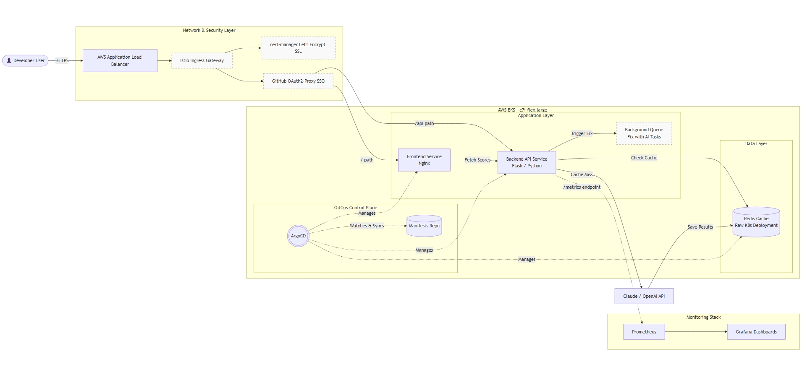

# 🏗 Architecture

                     |    🌐 User Browser    |
                     +-----------+-----------+
                                 |
                          HTTP Request (80)
                                 |
                                 v
                     +-----------------------+
                     |  ⚙️ Frontend (Nginx)  |
                     +-----------+-----------+
                                 |
                          /api proxy_pass
                                 |
                                 v
                     +-----------------------+
                     | 🐍 Backend API (Flask)|
                     +-----------+-----------+
                                 |
               +-----------------+-----------------+
               |                                   |
               v                                   v
     +-------------------+               +-------------------+
     | ⚡ Redis Cache     |               | 🔄 Background Job |
     +---------+---------+               |    Queue (Memory) |
               |                         +-------------------+
        Cached Response
               |
               v
     +-------------------+
     | 📊 Prometheus     |
     |    Metrics        |
     +---------+---------+
               |
               v
     +-------------------+
     | 📉 Grafana        |
     |    Dashboard      |
     +-------------------+
---
---

# 🏗️ System Architecture

  

This project follows a GitOps-based deployment pipeline where GitHub Actions builds container images, ArgoCD synchronizes Kubernetes manifests, and Amazon EKS runs the application. Redis is used for caching, background processing handles long-running tasks asynchronously, and Prometheus with Grafana provide observability.